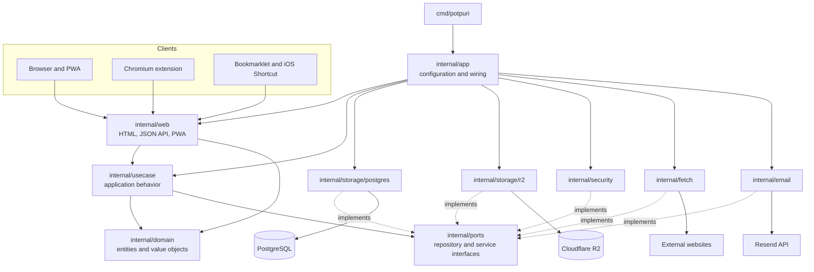

# Architecture

Potpuri is a server-rendered Go application organized around domain and use-case
layers. Dependencies point inward: delivery and infrastructure adapters depend
on interfaces and application behavior, while the core does not depend on HTTP,
PostgreSQL, Cloudflare R2, or email providers.

## Layers

- `cmd/potpuri` starts the process and delegates construction to the app factory.
- `internal/app` reads configuration and wires concrete adapters into the service and HTTP server.
- `internal/web` owns routes, authentication transport, server-rendered templates, the JSON API, and PWA resources.
- `internal/usecase` owns application workflows, authorization rules, quotas, capture behavior, and encryption orchestration.
- `internal/domain` contains the user and item domain types.
- `internal/ports` defines the interfaces used by the use-case layer.
- `internal/storage/postgres` stores users, sessions, encrypted item metadata, and blob metadata.
- `internal/storage/r2` optionally stores encrypted blob content outside PostgreSQL.
- `internal/security` provides encryption, password hashing, and encrypted search token generation.
- `internal/fetch` optionally retrieves page metadata or content during URL capture.
- `internal/email` sends verification messages through Resend.

The in-memory storage adapter under `internal/storage/memory` implements the same
ports for tests.

## Request Flow

1. A browser, PWA, extension, bookmarklet, or Shortcut sends an HTTP request to `internal/web`.
2. The web layer authenticates the session or API token and translates the request into use-case input.
3. The use-case service applies authorization, quotas, capture rules, and encryption.
4. Repository interfaces in `internal/ports` isolate the service from PostgreSQL and R2 implementations.
5. The web layer renders HTML or returns JSON from the resulting domain values.

## Data Protection

Item titles, bodies, source URLs, and uploaded blob contents are encrypted before
they reach persistent storage. Search uses deterministic tokens generated from
plaintext during writes, allowing lookup without storing searchable plaintext.
Passwords are stored as hashes, while API tokens and session credentials are
validated through hashed values rather than stored raw secrets.
